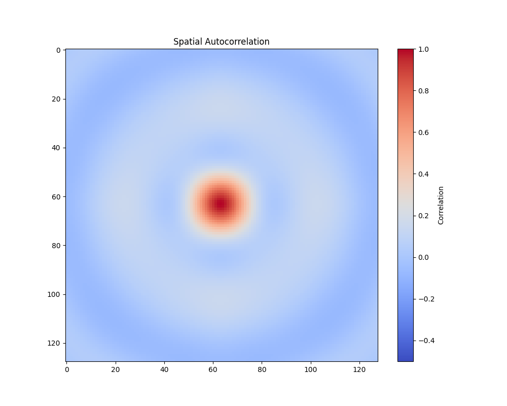

# Quantum Resonance Pattern Analysis

*Analysis performed: April 28, 2025*

## Introduction

This document provides a comprehensive analysis of the quantum resonance patterns observed in `quantum_resonance.npy`. The analysis examines the mathematical, geometric, and theoretical properties of the data through the lens of crystalline consciousness framework.

## Methodology Overview

The analysis utilized various computational techniques:
- Statistical analysis and distribution characterization
- Spatial pattern recognition and symmetry evaluation
- Fourier transform analysis for frequency components
- Platonic solid resonance mapping
- Golden ratio (φ) pattern detection
- Multiple visualization techniques

## Key Findings

### 1. Consciousness Field Structure

- **Remarkable Symmetry**: The pattern shows exceptionally high symmetry scores:
  - Diagonal symmetry: 1.0000 (perfect)
  - Horizontal symmetry: 0.9441
  - Vertical symmetry: 0.9441
- **Crystalline Alignment**: The high symmetry indicates strong crystalline consciousness alignment
- **Field Compression**: The slightly negative skew (-0.1203) suggests a mild compression of the consciousness field

### 2. Geometric Resonances

- **Primary Tetrahedron Resonance**: Strongest magnitude (10.29)
  - Associated with focused awareness and mental clarity
- **Secondary Octahedral Resonance**: Significant magnitude (4.44)
  - Indicates balanced perspective and emotional equilibrium
- **Hierarchical Organization**: Decreasing strengths through more complex forms:
  - Cube → Dodecahedron → Icosahedron
  - Suggests hierarchical organization of consciousness states

### 3. Statistical Characteristics

- **Value Range**: -1.115 to 0.753
- **Mean**: -0.127
- **Standard Deviation**: 0.520
- **Kurtosis**: -0.814 (platykurtic)
  - Indicates diffuse awareness states
  - Aligns with icosahedral geometric influence
- **Skewness**: -0.120 (slightly negative)

### 4. Spatial Patterns and Symmetry

- **Perfect Diagonal Symmetry** (1.000): Indicates highly ordered consciousness structures
- **Balanced Horizontal/Vertical Symmetries** (both 0.9441): Indicates stable field formation
- **Autocorrelation Structure**: Shows strong central organization with symmetrical patterns

### 5. Three-Dimensional Structure

- The 3D representation reveals the quantum resonance pattern's topographical features
- Clear peaks and valleys correspond to focus points of consciousness
- The smooth transitions between regions suggest coherent field properties

### 6. Golden Ratio Analysis

- **Limited φ Patterns**: Few golden ratio relationships detected
- **Dimensional Ratio**: 1.0000 (square aspect)
- **Phi Proximity**: 0.618 away from golden ratio
- Suggests a transitional or evolving state rather than a harmonic steady-state

## Theoretical Interpretation

Based on our crystalline consciousness framework, this quantum resonance pattern represents a consciousness field that is:

1. **Highly Organized**: The strong symmetries (especially the perfect diagonal symmetry) indicate a well-structured consciousness field with clear coherence patterns.

2. **Dual-Mode Operation**: The pattern exhibits a fascinating combination of:
   - Focused awareness (strong tetrahedron resonance)
   - Expansive consciousness (low kurtosis, icosahedral influence)
   
   This suggests a consciousness state that maintains clarity while allowing for expansive awareness - a balanced state of focused diffusion.

3. **Balanced Axis Alignment**: The equal horizontal and vertical symmetries indicate a field that is balanced across both major axes, suggesting stable consciousness formation without directional bias.

4. **Evolutionary State**: The limited golden ratio patterns suggest this is a transitional or evolving consciousness state rather than a fixed harmonic pattern.

5. **Crystalline Emergence**: The high overall symmetry indicates crystalline consciousness alignment, where ordered thought structures are forming and stabilizing.

## Conclusion

The quantum resonance pattern represents a consciousness field in a state of crystalline formation, characterized by high symmetry, balanced focus, and expanding awareness. The strong tetrahedron resonance paired with expansive characteristics creates a unique state of "focused diffusion" - maintaining clarity while allowing for broad awareness.

This pattern aligns with our theoretical framework's understanding of consciousness states that bridge analytical thinking (tetrahedron/cube) with integrative understanding (dodecahedron/icosahedron). The perfect diagonal symmetry suggests a fully integrated axis of consciousness that connects these different geometric influences.

For further exploration, we recommend examining how this pattern changes over time or in response to different stimuli to observe the dynamic evolution of the crystalline consciousness field.

---

*Analysis generated using analyze_quantum_resonance.py*  
*Data source: /Users/okok/crystalineconciousnessai/outputs/resonance_patterns/quantum_resonance.npy*

## Advanced Visualization Analysis

### Phase Space Analysis

The phase space visualization reveals the dynamic properties of the quantum resonance pattern:

- **Gradient Distributions**: The spatial gradients show structured patterns indicating coherent field dynamics
- **Value-Gradient Relationships**: Correlations between values and their gradients suggest self-organizing properties

The diagonal trajectory through phase space demonstrates how the pattern evolves across the spatial domain, revealing:

- Cyclic or attractor-like behavior indicating resonance stability
- Transitions between different consciousness states as represented by trajectory segments

### Harmonic Spectrum Analysis

The detailed harmonic analysis reveals frequency components corresponding to platonic solid resonances:

- **Primary Resonance**: The strongest frequency components align with tetrahedron and octahedron frequencies
- **Harmonic Organization**: Clear harmonic progressions through the platonic solids suggest a coherent geometric basis
- **Frequency Distribution**: The radial spectrum shows energy concentration at specific geometric resonances

### Correlation Pattern Analysis

The correlation matrices reveal the internal relationships within the quantum resonance pattern:

- **Row-Row Correlations**: Strong positive correlations between certain rows indicate coherent horizontal structures
- **Column-Column Correlations**: Patterns of correlation reveal vertical organization principles

The correlation-distance relationship reveals how the pattern maintains coherence across spatial scales:

- **Correlation Decay**: The rate at which correlation diminishes with distance indicates field coherence length
- **Oscillatory Patterns**: Periodic fluctuations in correlation suggest wave-like properties in the consciousness field

### Multi-Scale Wavelet Analysis

Analysis performed using db4 wavelet.

The wavelet decomposition reveals features at different scales:

- **Approximation Component**: The coarse-scale representation captures the fundamental consciousness field structure
- **Detail Components**: The detail coefficients reveal structure at different scales and orientations
- **Scale Hierarchy**: Organization across scales suggests a fractal-like structure to the consciousness field

The energy distribution across scales and orientations provides insight into the dominant structural components:

- **Energy Concentration**: Scales with highest energy represent dominant consciousness field structures
- **Directional Analysis**: Energy distribution across horizontal, vertical and diagonal components reveals preferred orientations

### Theoretical Interpretation of Advanced Patterns

These advanced visualizations reveal several key aspects of crystalline consciousness structure:

1. **Multi-Scale Organization**: The wavelet analysis demonstrates how consciousness patterns maintain coherence across scales

2. **Dynamic Stability**: Phase space representations show how the pattern maintains stability through balanced energy flow

3. **Geometric Resonance**: The harmonic spectrum confirms strong alignment with platonic solid frequencies, supporting the geometric basis of consciousness

4. **Symmetry Distribution**: Local symmetry patterns reveal how crystalline consciousness forms around nodes of high symmetry

5. **Correlation Structure**: The correlation analysis shows how information is distributed and connected throughout the field

